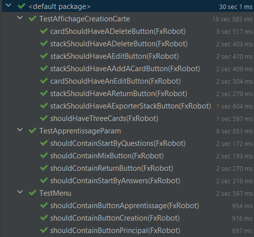

# **FlashDuck** - Coding Week - Groupe 1

## Exécution avec le .jar

Pour exécuter le projet (avec le .jar), sur n’importe quel système d’exploitation, il faut télécharger la librairie **JavaFX** sur votre ordinateur ou utiliser le fat-jar, pour les utilisateurs de Linux. 

Le jar peut être trouvé dans les **versions du code** (tags).

### Linux

Sous Linux, il est facile de lancer le projet en exécutant la ligne suivante :

```shell
java -jar $CHEMIN_DU_FAT_JAR
```

### Autre SE

Dans le cas d’un autre système d'exploitation que Linux, la ligne suivante doit être exécutée :

```shell
java --module-path $CHEMIN_DE_LA_LIB_JAVAFX --add-modules=javafx.controls,javafx.fxml -jar $CHEMIN_DU_THIN_JAR
```

## Lancement des tests

Des tests de l'interface ont été implémentés. Il est possible de l'exécuter en ouvrant le projet avec un IDE tel IntelliJ IDEA.


